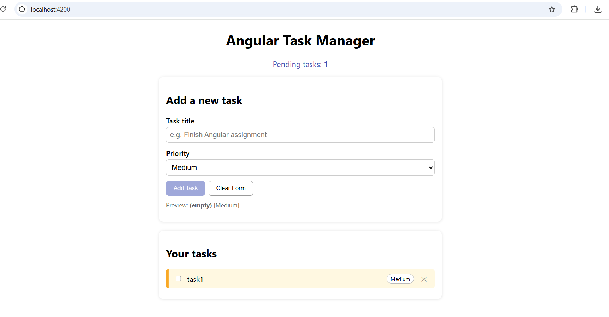
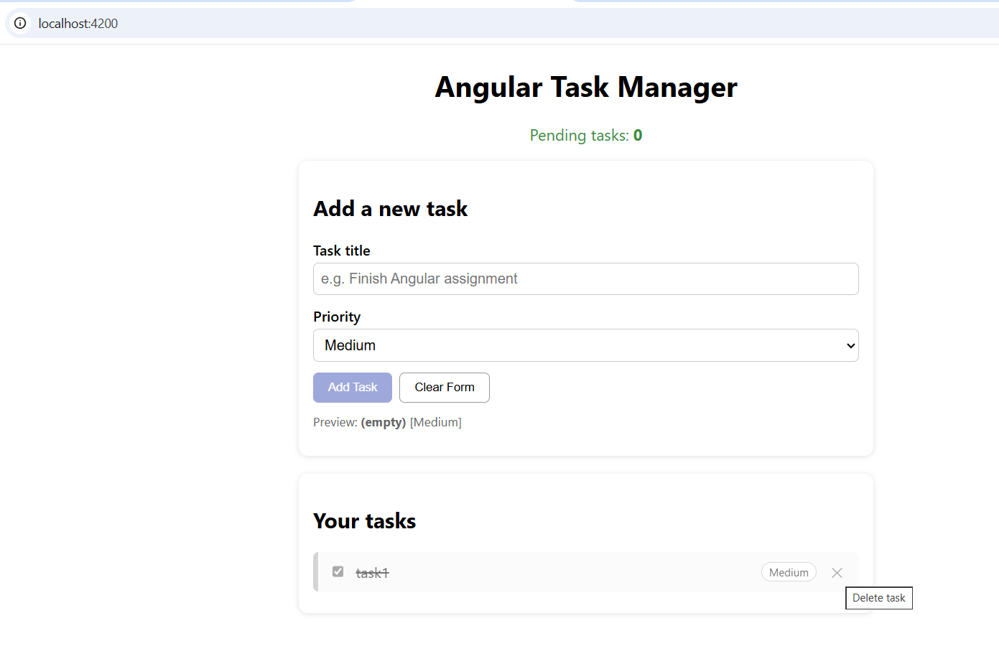
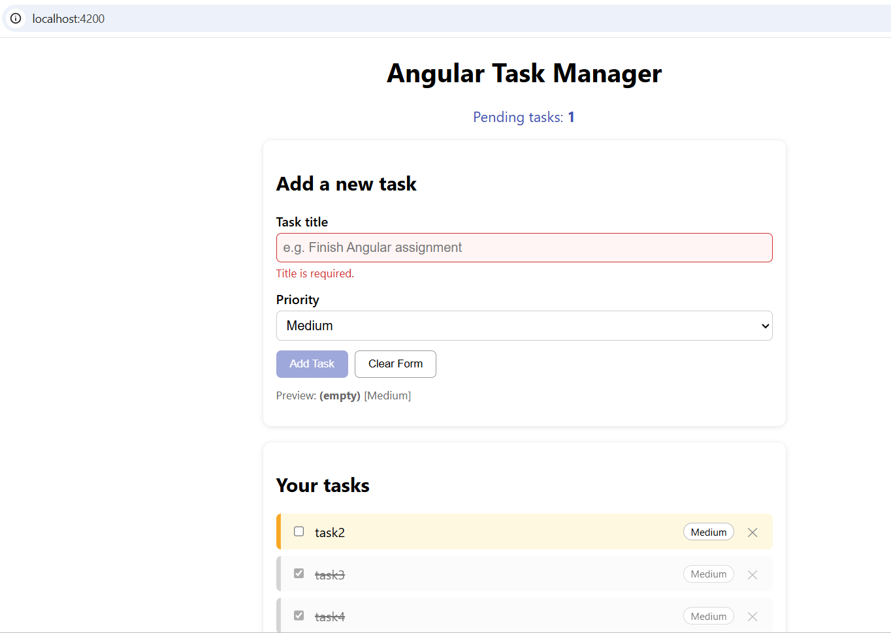

# Angular Task Manager

A simple task management app built with Angular that lets users add tasks with
priorities, mark them complete, and track pending work.

## Setup & Run
Prerequisites: Node.js 20.19+ (or 22.12+/24+), npm, Angular CLI (`npm i -g @angular/cli`).

    git clone <repo-url>
    cd task-manager
    npm install
    ng serve

Open http://localhost:4200. Run unit tests with `ng test`.

## Features
- Add tasks with title and priority (Low / Medium / High)
- Form validation (required, min length 3, max length 60, no whitespace-only)
- Clear Form button
- Priority-based colours
- Mark tasks complete (strikethrough, greyed out, moved to bottom)
- Delete tasks
- Empty-state message
- Live pending task count

## Components
| Component | Purpose |
|-----------|---------|
| `App` | Root; shows header and pending count |
| `TaskForm` | Form to create tasks |
| `TaskList` | Displays tasks and handles toggle/delete |
| `TaskService` | Shared state using signals |

## Angular Concepts Used
- Interpolation (`{{ }}`)
- Property binding (`[checked]`, `[value]`, `[disabled]`, `[attr.aria-label]`)
- Event binding (`(click)`, `(change)`, `(ngSubmit)`)
- Two-way binding (`[(ngModel)]`)
- Control flow: `@if`, `@else if`, `@for` with `track`
- Class binding for conditional styling (`[class.completed]`, `[class.high]`)
- Template-driven forms with validation and template reference variables
- Services, dependency injection (`inject()`), signals and `computed()`
- Standalone components with `imports`

## Screenshots

